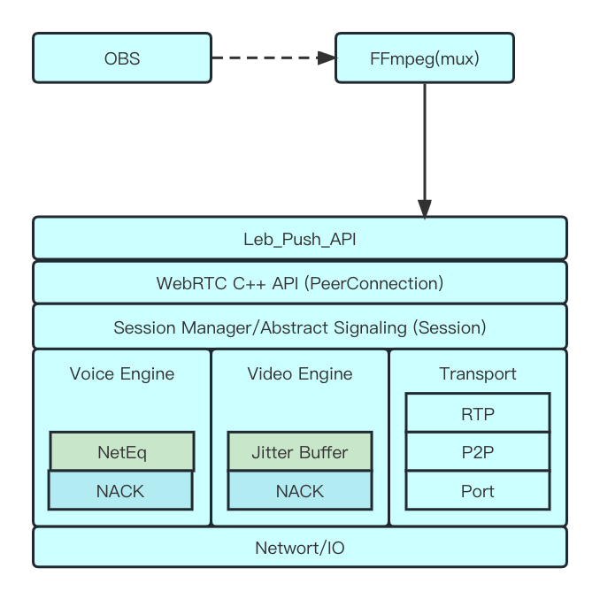
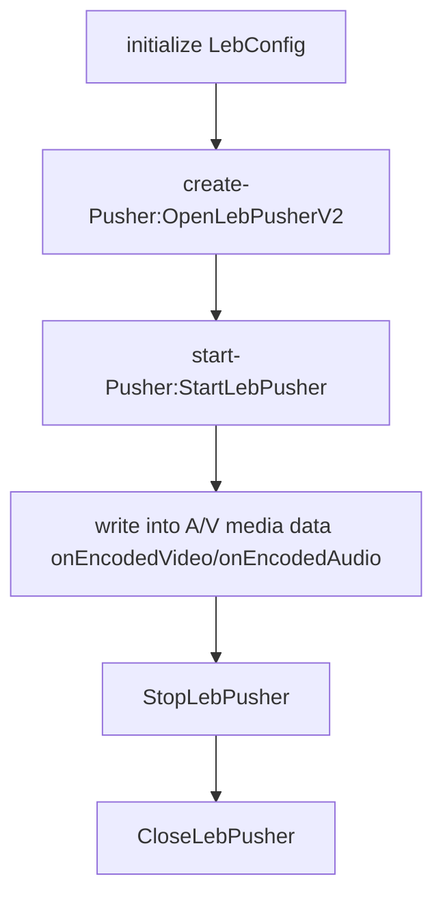

## LEB-PUSH base on WebRTC
   LEB(low-latency live streaming)

### 1> Main features
    Supports audio and video streaming, supports separate audio streaming and video streaming, supports H.264, H.265, AAC, Opus, and other codecs, supports AAC/LATM format.

### 2> SDK Module Framework

``
### 3> Interface API
#### 3.1> Initialize the configuration and create a streaming pusher
        typedef struct LebConfig {
          //  default set 0, and obs has supported.
          int is_whip;
          // push stream url:
          // "webrtc://webrtcpush.myqcloud.com/live/xxx"
          const char* stream_url;
          // signal ip or domation，default value as "webrtcpush.myqcloud.com"
          const char* signal_address;
          //if push video stream, please set 1. or 0
          int enable_video;
          // if push audio stream, please set 1. or 0
          int enable_audio;
          // Statistics callback interval, internal default 5 second. sorry this valueable has ms suffix. 
          float stats_period_ms;
          //Maximum number of tasks for scheduling one thread. default 100.
          uint32_t max_tasks_per_thread;
            //to-do
            //Set by sdk user. When a crash occurs, it will be set at the next startup.
            //  [
            //   {
            //     "time:":"2023-03-23 20:43:52",
            //     "sdkver":"1.0.1",
            //     "os":"15.5",
            //     "device" :"linux",
            //     "abi" : "x64",
            //     "stack" "崩溃堆栈",
            //   },
            //   {
            //     "time:":"2023-03-23 20:43:52",
            //     "sdkver":"1.0.1",
            //     "os":"15.5",
            //     "device" :"ios",
            //     "abi" : "arm64",
            //     "stack" "崩溃堆栈",
            //   }
            //   ]
          const char* last_bug_json;
          //to-do 
          const char* report_api;
          //TO-DO
        } LebConfig;
        //Initialize the configuration
        LebConfig config;
        config.is_whip = 0;
        config.stream_url = pushurl;
        config.signal_address = "webrtcpush.myqcloud.com";//"webrtcpush.myqcloud.com"
        config.enable_video = 1;
        config.enable_audio = 1;
        config.stats_period_ms = 0.f;
        config.max_tasks_per_thread = 200;
        config.last_bug_json = NULL;
        config.report_api = NULL;
        //create a leb pusher, and get pusher handler(LebPusherHandle).
        // this struct is seted by sdk.
        typedef struct LebPusherHandle {
          void* context;
          void* internal_handle;
          LebConfig config;
          LebCallback callback;
          // caller set log callback
          void (*onLogInfo)(void* context,
                                    const char* tag,
                                    LebLogLevel,
                                    const char* message);
          //caller set stat callback
          void (*onStatsInfo)(void* context, LebStats stats);
          //caller set error callback
          void (*onError)(void* context, LebErrorCode error);
          //caller set error callback
          void (*onErrorInfo)(void* context, LebErrorCode error, const char* strerror);
          //caller set connection state callback
          void (*onConnectionChange)(void* context, LebNetState state);
        } LebPusherHandle;
        typedef struct LebCallback {
          // caller use this function pointer to set video stream metadata.
          OnVideoInfo onVideoInfo;
          // caller use this function pointer to set audio stream metadata.
          OnAudioInfo onAudioInfo;
          // caller use this function pointer to write into video media data.
          OnEncodedVideo onEncodedVideo;
          // caller use this function pointer to write into audio media data.
          OnEncodedAudio onEncodedAudio;
          // // caller use this function pointer to write into stream metadata.
          OnMetaData onMetaData;
          //runtime control function pointer
          OnCtxControl onCtxControl;
        } LebCallback;
        LebPusherHandle *handle_ = OpenLebPusherV2(this, kInfo, config);
        //register callback function pointer
        a>connection state callback
        handle_->onConnectionChange = OnConnectionChangeCallback;
        b> error callback
        handle_->onError = OnErrorCallbck;
        c> log callback
        handle_->onLogInfo = OnLogCallback;
        d>statistic callback
        handle_->onStatsInfo = OnStatsCallback;
        //set leb push stream video/audio meta data.
        handle_->callback.onVideoInfo(handle_, video_info_);
        handle_->callback.onAudioInfo(handle_, audio_info_);
##### 3.2>start pusher
        StartLebPusher(handle_, config);
#### 3.3> write into video/audio media data
        LebEncodedVideoFrame videoframe;
        handle_->callback.onEncodedVideo(handle_, videoframe);
        LebEncodedAudioFrame audioframe; 
        handle_->callback.onEncodedAudio(handle_, audioframe);
#### 3.4> stop and close pusher
        StopLebPusher(handle_);
        CloseLebPusher(handle_);
### 4> LEB-PUSH sdk Flowchart

### 5> SDK Integration Method
#### 5.1> use api defined according to file leb_push_api.h
        Refer to the interface description above，Or the demo code provided in the sdk.
#### 5.2> Encapsulate muxer module through ffmpeg
    Integrate webrtc streaming function through ffmpeg. Directly use ffmpeg to implement webrtc leb Push streaming。
    You can refer to the webrtc_muxer.c file in the sdk。if you want to get the muxer code, please in touch with developer
    AVOutputFormat ff_webrtc_muxer = {
        .name              = "webrtc",
        .long_name         = NULL_IF_CONFIG_SMALL("webrtc"),
        .mime_type         = "video/webrtc",
        .extensions        = "webrtc",
        .priv_data_size    = sizeof(LibWebRTCContext),
        .audio_codec       = AV_CODEC_ID_OPUS | AV_CODEC_ID_AAC,
        .video_codec       = AV_CODEC_ID_H264,
        .init              = webrtc_init,
        .write_header      = webrtc_write_header,
        .write_packet      = webrtc_write_packet,
        .write_trailer     = webrtc_write_trailer,
        .deinit            = webrtc_free,
        .flags             = AVFMT_GLOBALHEADER | AVFMT_ALLOW_FLUSH | AVFMT_TS_NEGATIVE | AVFMT_NOFILE,
        .codec_tag         = (const AVCodecTag* const []){ codec_webrtc_tags, 0 },
        //.check_bitstream   = webrtc_check_bitstream,
        .priv_class        = &webrtc_class,
    };
##### 5.3> use ffmpeg in the sdk zip files.
    ffmpeg muxer plugin params.
    -webrtc_signal    this specify the signaling server
    -is_aac_latm      support aac out of band.
    -fillsei_avdiff   add debug sei for computer audio - video synchronization timestamp difference
    -is_whip          support whip protocol
    -b_frame          support b frame push
    -bitrate_cfg      set bitrate in config
    -stats_period_ms  stat callback interval 
    -stat_api         report api
    -stream_pri       stream priority
    
    ffmpeg example:
    ffmpeg -re -stream_loop -1 -i /Users/ts/test/machine.flv  -c:v copy -acodec copy -bsf:a aac_adtstoasc -f webrtc "webrtc://xxx/live/webrtc_test_7007?txSecret=f9269a11eab5b80c8fe540c7b68a084b&txTime=65C105FF"

### 6>SDK
#### 6.1> linux version sdk:
    SDK donwload latest version：
    https://media-frame-1258344699.cos.ap-nanjing.myqcloud.com/tstan/xp2p/leb_push_sdk_linux_release_v_1.1.2_34e32e4ebe_md96f396a453_2023_11_01_20_57.zip
    
    sdk content：
    leb_push_sdk  
    ├── leb_push_api.h
    └── libLebPusher_so.so
    
    ffmpeg integrated with sdk:
    sdk_demo/
    └── ffmpeg_g

#### 6.2> macos sdk
    if you want to get the sdk, please in touch with developer https://github.com/troman123
    TO-DO
//
#### 6.3> window sdk
    if you want to get the sdk, please in touch with developer https://github.com/troman123
//

